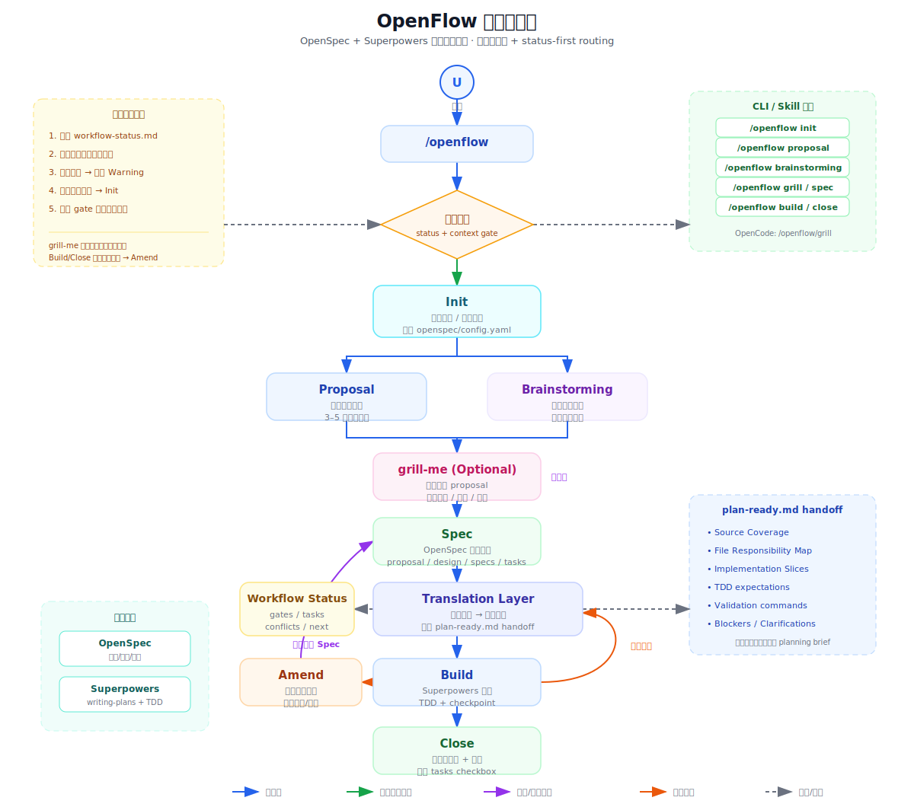

# @lininn/openflow

[English](./README.md)

OpenSpec + Superpowers 工作流协调器，串联需求规格与工程执行，消除格式鸿沟。

## 安装

```bash
npm install -g @lininn/openflow
```

## 使用

### 初始化项目

```bash
cd your-project
openflow init --tools claude
```

`init` 会自动：
1. 检测并引导安装 OpenSpec CLI
2. 检测 Superpowers 并提示安装方式
3. 检测项目 OpenSpec 初始化状态
4. 生成 openflow skills 到所选工具的项目级 skill 目录，如 `.claude/skills/openflow/`、`.codex/skills/openflow/`、`.cursor/skills/openflow/` 或 `.opencode/commands/openflow/`

支持的工具：`claude`、`codex`、`cursor`、`opencode`（逗号分隔，如 `--tools claude,codex`）

### 安装到全局 skills

```bash
openflow init --tools claude -g
openflow init --tools claude,codex,cursor,opencode --global
```

加 `-g` / `--global` 后，`openflow` 会把 skills 安装到所选工具的全局目录：

| 工具 | 全局 skill 路径 |
|------|-----------------|
| `claude` | `~/.claude/skills/openflow/` |
| `codex` | `~/.codex/skills/openflow/` |
| `cursor` | `~/.cursor/skills/openflow/` |
| `opencode` | `~/.opencode/commands/openflow/` |

### 查看状态

```bash
openflow status
```

显示依赖安装状态和项目中的活跃变更。

### 更新 skills

```bash
openflow update
```

升级 npm 包后运行，重新生成项目内的 skills 文件。

## 工作流命令

规范调用方式是 `/openflow <阶段>`。为了改善补全体验，Claude Code、
Codex 和 Cursor 会额外生成可见的阶段别名，例如 `/openflow-spec` 或
`$openflow-spec`，这样在命令/skill 选择器里输入 `openflow` 时能看到可用阶段。
OpenCode 保持原生命令树形式，例如 `/openflow/spec`、`/openflow/build`。

| 命令 | 阶段 | 说明 |
|------|------|------|
| `/openflow proposal` | proposal | 轻量提问，3-5 问快速收敛需求 |
| `/openflow brainstorming` | brainstorming | 深度设计，多轮方案探索 |
| `/openflow grill` | grill | 可选压力测试，在 spec 前挑战 proposal 假设 |
| `/openflow spec` | spec | 调用 OpenSpec 生成规格 + 自动翻译 |
| `/openflow amend` | amend | close 前修订需求/规格并更新 plan-ready.md |
| `/openflow build` | build | 调用 Superpowers 执行实现 |
| `/openflow close` | close | 验证一致性 + 归档 |

`/openflow grill` 是可选阶段：proposal 已经足够清晰时可以跳过；需要在进入 spec 前挑战隐藏假设和边界时再使用。spec 阶段现在把 `plan-ready.md` 视为交给 Superpowers 的详细 handoff，而不是任务摘要：必须保留来源覆盖、文件责任、实现切片、TDD 期望、验证命令和阻塞项。

## 依赖策略

```
Best with: OpenSpec + Superpowers
Works without them: yes, with manual-file fallback
```

| 依赖 | 安装方式 | 缺失时降级 |
|------|----------|-----------|
| OpenSpec | `npm install -g @fission-ai/openspec@latest` | 手动创建 `openspec/changes/` 目录和文件 |
| Superpowers | `/plugin install superpowers@claude-plugins-official` | build 阶段手动拆解 plan-ready.md 步骤执行 |

### 双层依赖保障

| 层 | 机制 | 缺失时 |
|----|------|--------|
| **init 时** | 从 `PATH` 检测 OpenSpec CLI；从 `./openspec/` 检测当前项目 OpenSpec；从所选工具的本地/全局 skill 目录检测 Superpowers | 不阻断，继续生成 skills |
| **运行时** | SKILL.md 注入依赖检测段 | build 阶段降级为手动拆解步骤执行 |

## 架构

> 详细图表：[架构图 (SVG)](./openflow-architecture.svg) | [架构图 (PNG)](./openflow-architecture.png) | [流程图 (SVG)](./openflow-workflow.svg) | [流程图 (PNG)](./openflow-workflow.png)



```
用户需求
   │
   ├── 轻量 ──→ /openflow proposal ──┐
   │          3-5问快速收敛          │
   │                                 ├─→ proposal.md
   └── 深度 ──→ /openflow brainstorming ─┘ (openspec/changes/<name>/)
               多轮方案探索
                                     │
                          ┌──────────▼───────────┐
                          │  /openflow grill      │
                          │  可选压力测试          │
                          └──────────┬───────────┘
                                     │
                          ┌──────────▼───────────┐
                          │  /openflow spec        │
                          │  OpenSpec 生成规格      │
                          └──────────┬───────────┘
                                     │
                          ┌──────────▼───────────┐
                          │   翻译层 (核心)        │
                          │  需求视角 → 工程视角    │
                          └──────────┬───────────┘
                                     │
                                plan-ready.md
                                     │
                          ┌──────────▼───────────┐
                          │  /openflow build       │
                          │  Superpowers 执行      │
                          │  TDD 铁律 + 断点恢复   │
                          └──────────┬───────────┘
                                     │
                          ┌──────────▼───────────┐
                          │  /openflow amend      │
                          │  需求变更修订          │
                          │  （仅需要时）           │
                          └──────────┬───────────┘
                                     │
                          ┌──────────▼───────────┐
                          │  /openflow close       │
                          │  验证一致性 + 归档      │
                          └──────────────────────┘
```

## 致谢

openflow 编排了以下两个开源项目：

| 项目 | 仓库 | 许可证 | 使用方式 |
|------|------|--------|----------|
| [OpenSpec](https://github.com/Fission-AI/OpenSpec) | `@fission-ai/openspec` | MIT | 生成结构化规格文件（proposal.md、design.md、specs/、tasks.md）。openflow 调用其 CLI 并读取其输出格式。 |
| [Superpowers](https://github.com/obra/superpowers) | `superpowers` 插件 | MIT | 提供 `writing-plans` skill 用于生成详细实现计划。openflow 在 build 阶段委托其工作流执行。 |

openflow 是**独立编排器** — 不捆绑、不分叉、不嵌入任何项目的代码。依赖在 init/运行时检测，任一缺失时降级为手动模式。

## License

MIT
